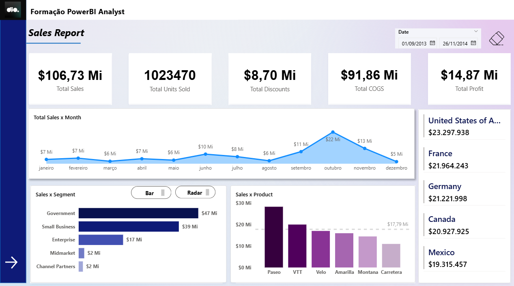
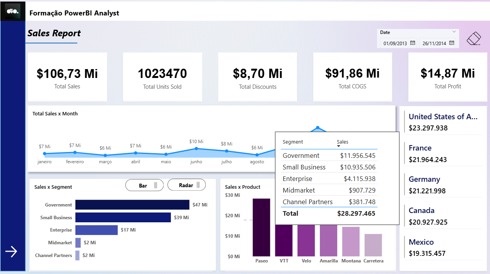
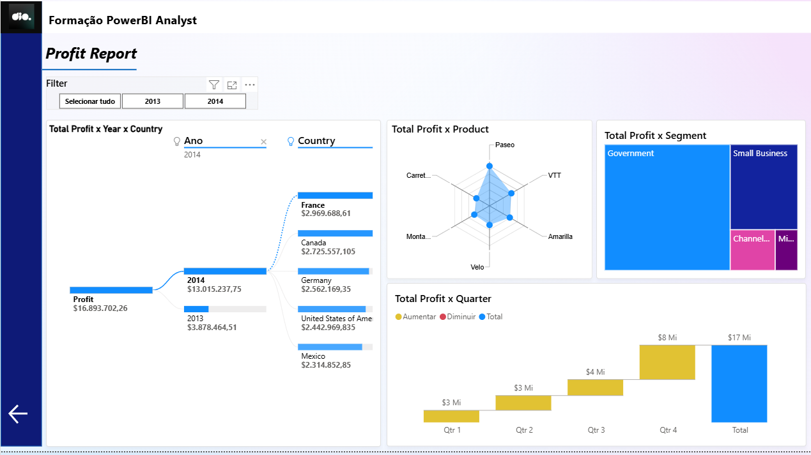
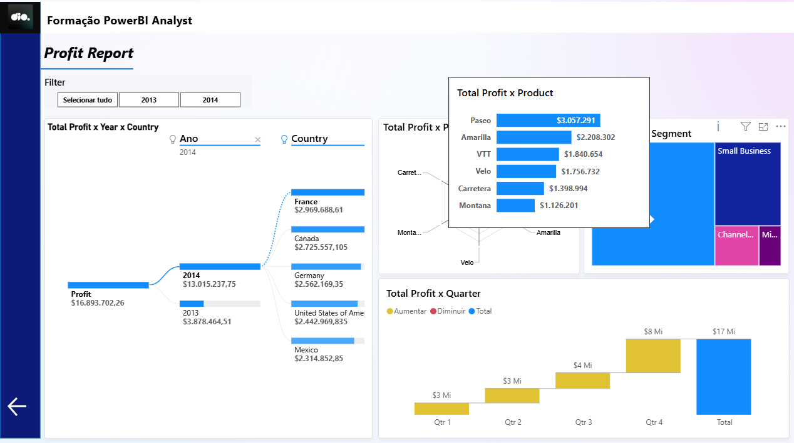

# Projeto: Relatório de Vendas e Lucratividade (Formação Power BI Analyst)

Este projeto é um dashboard analítico completo criado no **Microsoft Power BI**, desenvolvido como parte da "Formação PowerBI Analyst". O relatório é dividido em duas seções principais, acessíveis por navegação: um **Sales Report** (Relatório de Vendas) e um **Profit Report** (Relatório de Lucratividade).

O objetivo é fornecer uma análise abrangente do desempenho da empresa, permitindo a exploração de métricas de vendas e, em seguida, um mergulho profundo nos fatores que impulsionam a lucratividade.

**Base de Dados:** A análise utiliza a base de dados de exemplo (sample) **"Financials"** da Microsoft, que inclui dados fictícios de vendas por segmento, produto, país e data.

## 🛠️ Ferramentas Utilizadas

* **Microsoft Power BI Desktop:** Utilizado para modelagem de dados, cálculos DAX e criação de todo o layout e visuais do relatório.
* **DAX (Data Analysis Expressions):** Usado para criar as métricas centrais, como `Total Sales`, `Total Profit`, `Total COGS`, etc.

---

## Páginas do Relatório

O dashboard é composto por duas páginas principais com objetivos distintos.

### 1. Página: Sales Report (Relatório de Vendas)

Esta é a página principal, focada em fornecer uma visão geral (overview) do desempenho de vendas.

---

---

#### Principais Indicadores (KPIs)
* **Total Sales:** Receita total de vendas ($106,73 Mi).
* **Total Units Sold:** Número total de unidades vendidas (1.023.470).
* **Total Discounts:** Valor total concedido em descontos ($8,70 Mi).
* **Total COGS:** Custo total dos produtos vendidos ($91,86 Mi).
* **Total Profit:** Lucro total gerado ($14,87 Mi).

#### Análises Visuais
* **Total Sales x Month (Gráfico de Linha):** Demonstra a sazonalidade das vendas, com um pico notável em outubro.
* **Sales x Segment (Gráfico de Barras):** Compara o desempenho dos segmentos de mercado, destacando "Government" ($47 Mi) e "Small Business" ($39 Mi) como os principais.
* **Sales x Product (Gráfico de Colunas):** Classifica os produtos por receita, com "Paseo" sendo o líder de vendas.
* **Vendas por País (Lista):** Exibe o total de vendas para os principais países (EUA, França, Alemanha, etc.) na lateral direita.

---

### 2. Página: Profit Report (Relatório de Lucratividade)

Esta página oferece uma análise mais profunda (deep dive) especificamente sobre o Lucro, utilizando visuais avançados para decompor os resultados.

---

#### Filtros
* **Ano:** Permite ao usuário filtrar a análise por um ano específico (ex: 2013, 2014) ou ver todos os dados.

#### Análises Visuais
* **Total Profit x Year x Country (Gráfico de Decomposição):** O visual central da página. Permite ao usuário quebrar o lucro total ($16,89 Mi) primeiro por ano e depois por país (ou outras dimensões), facilitando a identificação dos principais motores de lucro.
* **Total Profit x Product (Gráfico de Radar):** Mostra a performance de lucratividade de cada produto em um formato multidimensional.
* **Total Profit x Segment (Treemap):** Demonstra a participação de cada segmento no lucro total, onde o tamanho do retângulo é proporcional ao valor. "Government" e "Small Business" são os segmentos mais lucrativos.
* **Total Profit x Quarter (Gráfico de Cascata):** Ilustra como o lucro foi acumulado trimestre a trimestre (Qtr 1 a Qtr 4), facilitando a visualização do crescimento ao longo do ano.

## 🚀 Recursos de Destaque

* **Navegação entre Páginas:** O relatório utiliza botões de navegação (ícones de seta) para criar uma experiência de aplicativo, guiando o usuário da visão geral de vendas para a análise de lucro.
* **Visuais Avançados:** O projeto demonstra o uso de visuais analíticos poderosos, como o **Gráfico de Decomposição (Decomposition Tree)**, **Gráfico de Cascata (Waterfall)**, **Treemap** e **Gráfico de Radar (Radar Chart)**.
* **Tooltips Interativos:** Como visto nas imagens de suporte, o relatório utiliza tooltips (dicas de ferramenta) personalizados que fornecem detalhes adicionais quando o usuário passa o mouse sobre um visual, sem poluir a tela.
* **Design Moderno:** O layout é limpo, com um menu lateral fixo, um cabeçalho claro e um esquema de cores coeso, focado na usabilidade.
